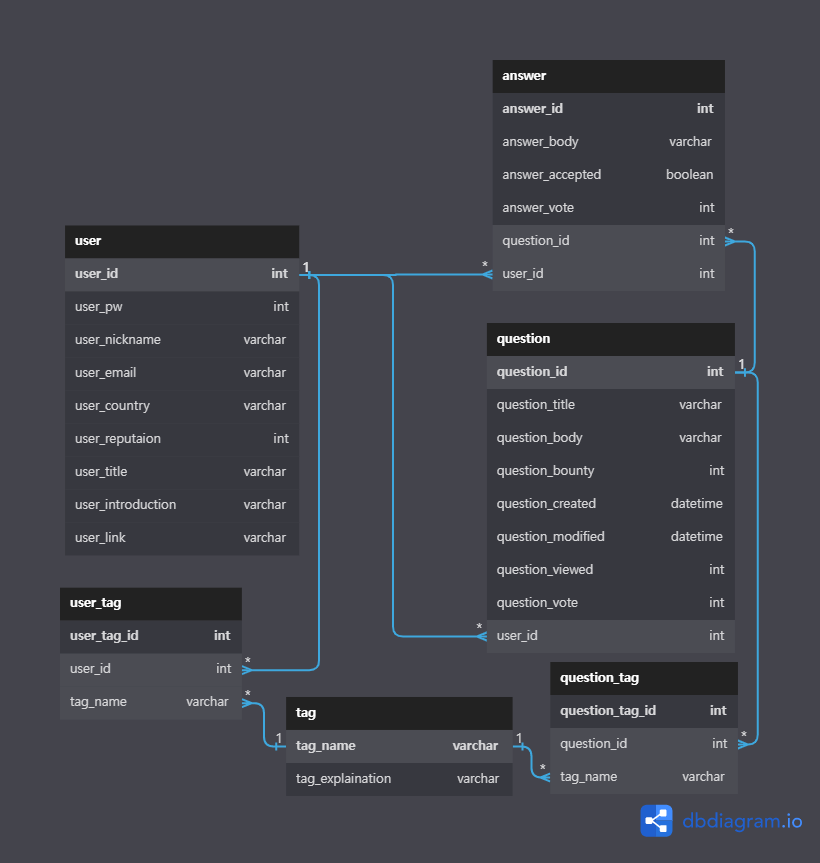

# 🎴 삼땡

안녕하세요. 코드스테이츠 FE & BE 41기 33조, **삼땡**조입니다.

12월 15일 ~ 1월 2일까지 약 2주간 Stackoverflow 웹 페이지를 함께 만들었습니다. 😊

## 👥 TeamMates

### Front-End

|  |  |   |
| :---: | :---: | :---: |
| [ 김동규(@Rbaam) ](https://github.com/Rbaam) | [ 조유지(@EliseCho13) ](https://github.com/EliseCho13) | [ 최창훈(@cjsrmachs) ](https://github.com/cjsrmachs) |
| Question, Answer | User, UserTag | - |

### Back-End

|  |  |
| :---: | :---: |
| [ 변찬중(@chaning49) ](http://github.com/chaning49) | [ 윤인수(@Insu-Yoon) ](https://github.com/Insu-Yoon) |
| User, UserTag, Security | Question, Answer,   Tag, QuestionTag, AnswerTag |

## 🛠 Tech Stack

### Common

### Front-End

### Back-End

## 🗂️ Contents

### [**👉🏻 API 명세서 링크**](http://ec2-15-164-87-251.ap-northeast-2.compute.amazonaws.com:8080/swagger-ui.html#/)

### **User (+ login, changePassword, accountRecovery)**

- Create: 유저는 회원가입을 통해 계정을 생성한다.
- Read: 유저는 특정 유저 또는 전체 유저의 정보를 조회할 수 있다. 만약 로그인 되어 있는 상태라면 자신의 정보를 수정할 수도 있다.
- Update: 유저는 자신의 정보를 수정할 수 있다.
- Delete: 유저는 회원 탈퇴로 자신의 계정을 DB에서 제거할 수 있다.

### **Question**

- Create: 유저는 자신의 질문을 작성하여 등록할 수 있다.
- Read: 특정 유저 또는 전체 유저의 질문을 조회할 수 있다. 또한 질문에 포함된 키워드나 태그를 통해 검색할 수 있는 기능이 있다.
- Update: 질문의 내용이나 태그를 수정할 수 있다. 그리고 질문을 투표할 때마다 변한 값이 반영된다.
- Delete: 사용자가 등록한 질문은 삭제할 수 있다.

### **Answer**

- Create: 특정 질문에 대한 답변을 작성할 수 있다.
- ~~Read~~: - , 질문에 붙어서 자동으로 로드되기 때문에 구현하지 않았다.
- Update: 질문을 작성한 유저만이 답변을 채택하거나 수정할 수 있다. 또한 답변에 투표를 하는 기능도 구현돼있다.
- Delete: 답변 작성자라는 것을 인식하면 답변을 삭제할 수 있다.

### **Tag**

- Read: 전체 태그를 조회한다.
- Read: 태그를 검색할 수 있다.

## 🩻 E-R Diagram

- 백엔드에서 DB 설계를 위해 만든 ERD입니다.
- 각 엔티티 간의 관계를 고려하여 N:N, 1:N, N:1 관계를 정의하고 테이블을 만들어주었습니다.

## 🎞 Commit Conventions

---

| 이름 | 설명 |
| --- | --- |
| init | 처음 초기 세팅을 할때 사용 |
| chore | 기타 작업을 할 경우 사용(설정 변경) |
| feat | 새로운 기능을 추가할 때 사용 |
| fix | 버그 수정 및 성능 개선 시 사용 |
| merge | main / dev branch에 merge 해야 할 경우에 사용(자동 생성으로 사용해도 OK) |
| refactor | 버그 수정 및 기능을 추가하지 않는 코드를 변경할 때 사용 |
| remove | 파일을 삭제하는 작업만 수행한 경우 |
| setup | 폴더나 전체적인 구조 설정을 할 경우 사용 |
- 개발 시작 전후 또는 branch를 생성하기 전에 pull로 최신 상태를 만들어줍니다.
- commit 내용은 한글, 영어의 제한 없이 자유롭게 작성할 수 있습니다.
- 기능 구현은 feat branch를 이용하고, dev branch에 push하여 내용을 merge합니다.

## 🖥 View

- 작성중…
